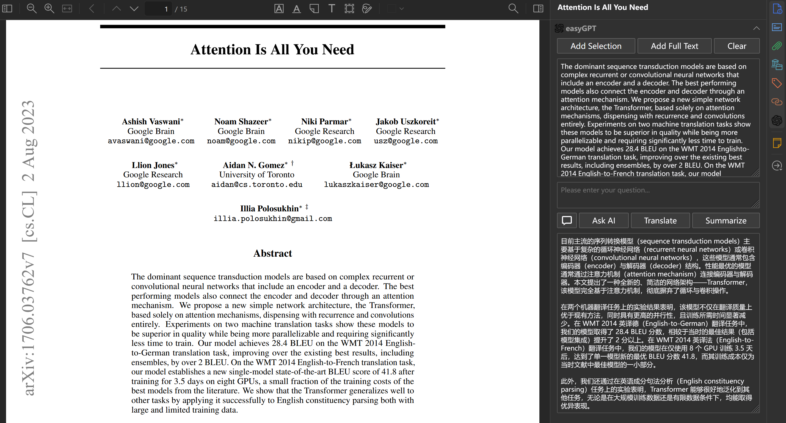
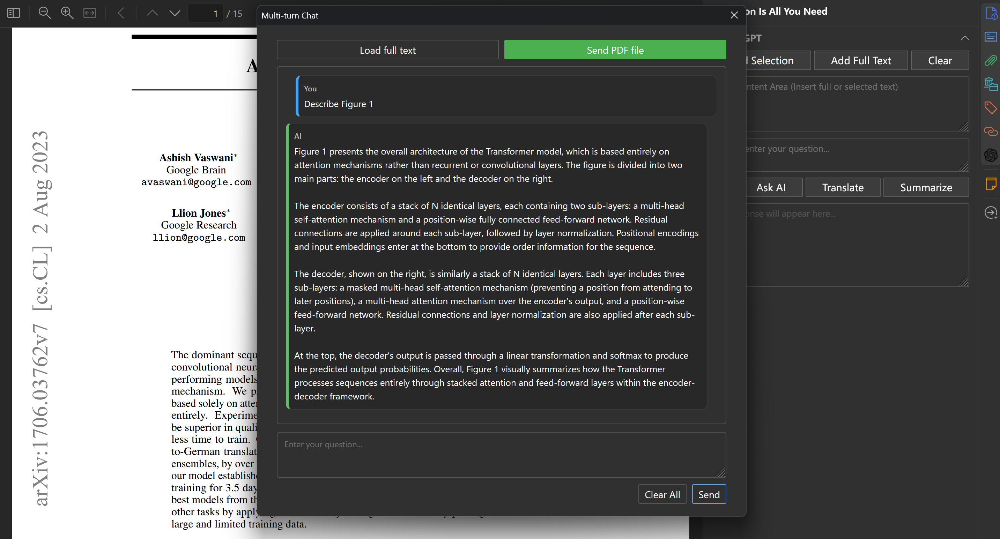
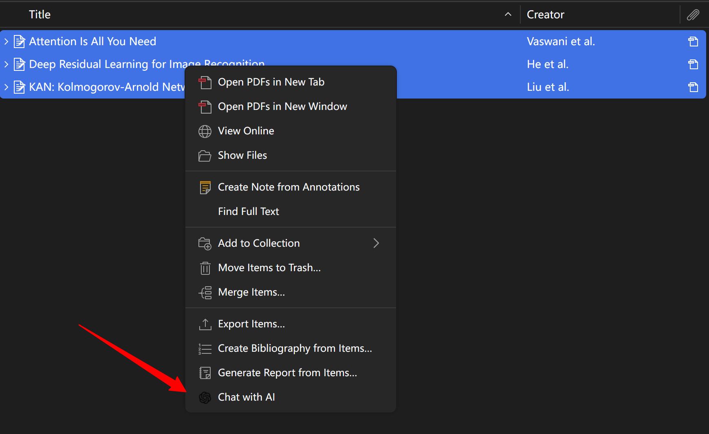
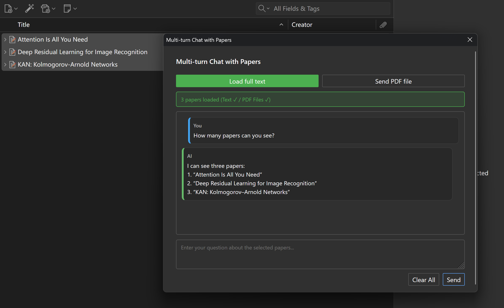

# Zotero-easyGPT

  

A plugin that integrates Large Language Models functionalities into Zotero. Ask questions about or summarize PDF content directly within Zotero. 

## Main Features

- [x] 📝 **Single-Turn Q&A**: Ask questions about PDF content directly in the sidebar with instant AI responses.
- [x] 🔁 **Multi-Turn Chat Dialog**: Open a dedicated popup window for continuous multi-turn conversations with full PDF context.
- [x] 📤 **Multi-Paper Chat**: Select up to 10 papers and engage in conversations with all of them simultaneously through right-click menu "Chat with AI".
- [x] 📄 **PDF File Upload**: Directly upload PDF files for analysis and interaction.
- [x] 📋 **PDF Sidebar Integration**: All features seamlessly integrated into the Zotero PDF reader sidebar.
- [x] 🔍 **Text Selection & Full Text Support**: Insert selected text or entire PDF content with one click.
- [x] 🌐 **One-Click Translation**: Translate PDF content between Chinese and English automatically.
- [x] ✏️ **One-Click Summarization**: Generate PDF summaries instantly.
- [x] 🌓 **Dark Mode Support**: Adapts to Zotero's light/dark theme automatically.
- [x] 🌏 **Multi-Language UI**: Interface available in English and Chinese (auto-switches based on settings).
- [x] 🔌 **OpenAI-Compatible API**: Works with OpenAI, DeepSeek, Silicon Flow, or any compatible service.
- [x] ⚙️ **Customizable Settings**: Configure API endpoint, model, and key to fit your needs.
- [x] 🎯 **Dual Model Configuration**: Use different models for single-paper and multi-paper conversations to optimize costs.
- [x] 🛠️ **PDF Engine Selection**: Choose from multiple PDF processing engines (Auto, Native, PDF Text, Mistral OCR) for OpenRouter API.

## Screenshots

### Sidebar Integration

  
  
<i>PDF sidebar with AI features: text selection, translation, summarization, ask questions, and multi-turn chat</i>

### Multi-Turn Chat Dialog

  
  
<i>Dedicated popup window for multi-turn conversations with full context</i>

### Multi-Paper Chat

  

  
  
<i>Select multiple papers and chat with all of them simultaneously</i>

## Usage

### Sidebar Features
- **Add Selection**: Click to insert selected PDF text into the input area.
- **Add Full Text**: Click to load entire PDF content for context.
- **Clear**: Clear the input area.
- **Ask AI**: Send your question to get an AI response (single-turn).
- **Translate**: One-click translation based on detected language.
- **Summarize**: Generate a summary of the loaded PDF content.
- **Multi-Turn Dialog**: Opens a popup window for continuous conversations.

### Multi-Turn Chat
- Click the **Multi-Turn Dialog** button (💬 icon) in the sidebar to open a popup window.
- PDF full text is automatically loaded when the dialog opens.
- You can also upload a PDF file directly in the dialog (supports diagrams).
- **Send**: Submit your question (or use `Ctrl+Enter`).
- **Clear All**: Reset the conversation history completely.
- Each session starts fresh with no previous history.

### Multi-Paper Chat
- **Select Papers**: In Zotero library, select 1-10 paper items (without opening PDFs).
- **Right-Click Menu**: Right-click on selected items and choose **"Chat with AI"**.
- **Auto-Load**: All PDFs are automatically loaded with progress indicator.
- **Status Display**: Shows loading status for both text and PDF files (e.g., "5 papers loaded (Text ✓ / PDF Files ✓)")
- **Chat**: Ask questions about any or all of the selected papers in one conversation.

### Installation & Setup
- Get `.xpi` file: [download latest](https://github.com/KravornN/Zotero-easyGPT/releases/latest/download/zotero-easygpt.xpi) release `.xpi` file
- Install `.xpi` file in Zotero
- Open Zotero-easyGPT settings and configure:
  - **API Key**
  - **Base URL**: API endpoint (need not add /v1 e.g., `https://api.openai.com` or `https://openrouter.ai/api`)
  - **Model (Single Paper)**: Model for sidebar Q&A, translation, summarization, and single-paper multi-turn chat
  - **Model (Multiple Papers)**: Model for multi-paper conversations
  - **PDF Engine (OpenRouter)**: Choose PDF processing engine when using OpenRouter:
    - **Auto**: Automatically selects the engine (native → mistral-ocr)
    - **Native**: Uses model's native file processing (charged as input tokens)
    - **PDF Text**: Free text extraction for well-structured PDFs
    - **Mistral OCR**: Advanced OCR ($2/1K pages)
  - **Answer Language**

### 中国用户
可以使用硅基流动等api提供商，例如：

* **Base URL:** 填入 `https://api.siliconflow.cn`
* **Model:** 选择 `deepseek-ai/DeepSeek-V3` (或其他)
* **API Key:** 填入你的硅基流动 API Key
* 配置完成后即可使用。

**也可以使用其他兼容OpenAI的API服务**

### International Users

You can use OpenAI or other services compatible with the OpenAI API specification.

**Using OpenAI:**

* **API URL:** Enter `https://api.openai.com`
* **Model:** Choose the OpenAI model you wish to use. Ensure your API key has permissions for the selected model.
* **API Key:** Enter your OpenAI API Key.
* Once configured, it's ready to use.

**Using other compatible services (e.g., Azure etc.)**
